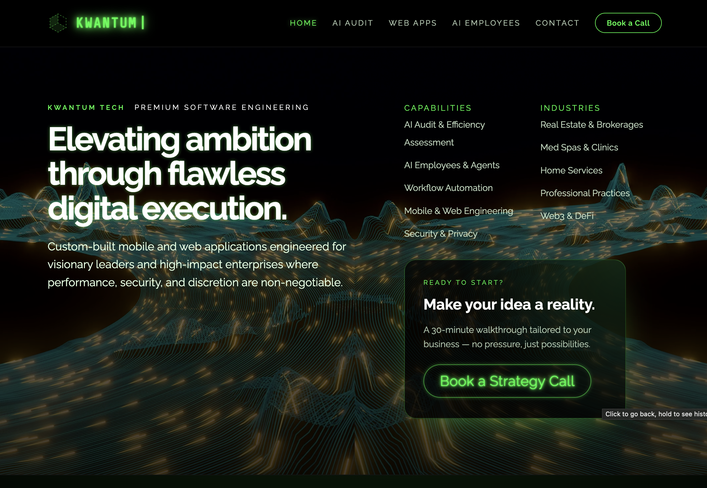

# Kwantum Tech

Home of **Kwantum Tech**, the flagship site for **Kwantum Consulting LLC**. This project is a
high-contrast, futuristic landing experience featuring a video-backed hero, GSAP micro‑interactions,
and a sleek services + footer layout.

## Snapshot



## What’s inside

- **Hero** with full-bleed video background and interactive CTA tilt
- **Capabilities + Industries** overview in the hero
- **Services** section tailored to high‑touch consulting engagements
- **Minimal footer** with brand + contact CTA

## Development

Install dependencies:

```sh
npm install
```

Run the dev server:

```sh
npm run dev
# open in a browser
npm run dev -- --open
```

## Contact form

The inquiry form posts to the SvelteKit backend at `/api/contact`, which sends mail through Resend.

Set these environment variables in Netlify:

```sh
RESEND_API_KEY=...
CONTACT_FROM_EMAIL="Kwantum Tech <me@example.com>"
CONTACT_TO_EMAILS="me@example.com"
```

When using Resend's default sender in testing mode, Resend only allows delivery to the account email. Verify your sending domain in Resend before using your production sender and recipient list.

## Build

Create a production build:

```sh
npm run build
```

Preview the production build:

```sh
npm run preview
```
